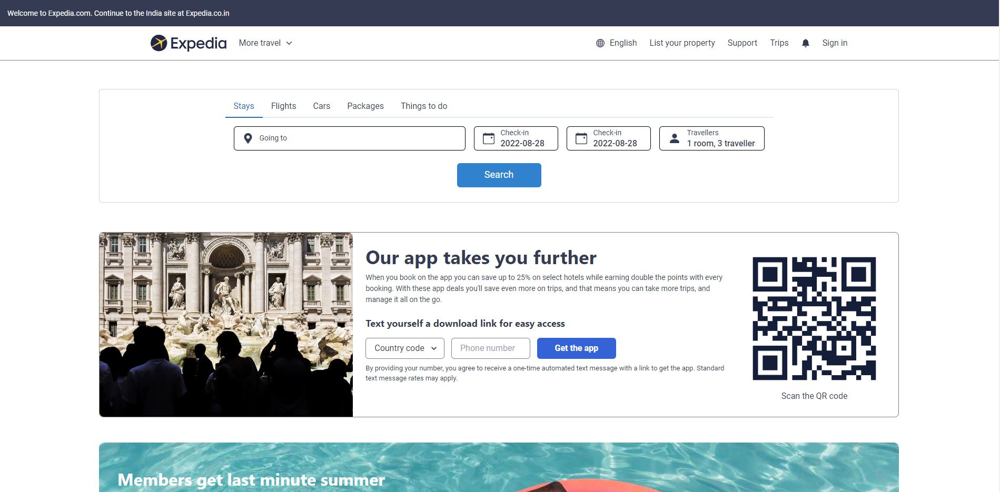
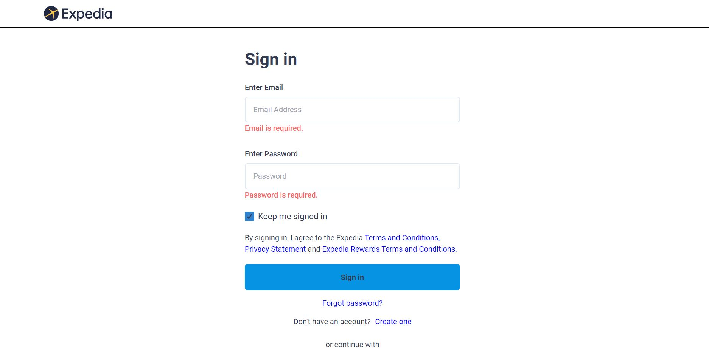
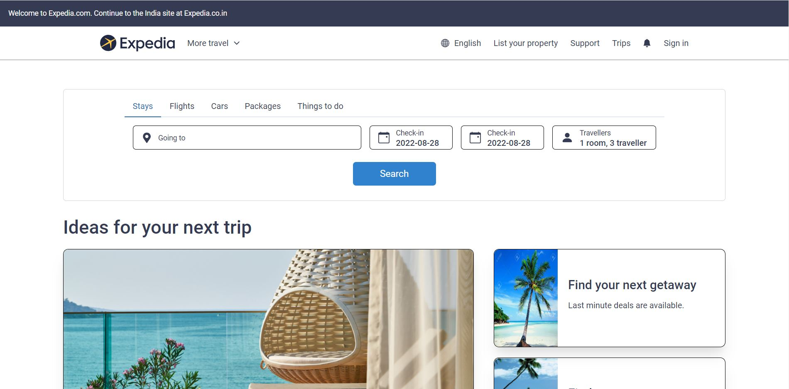
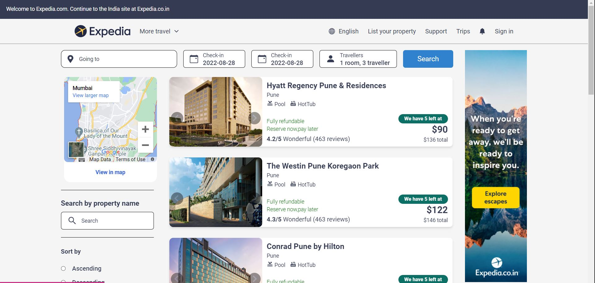
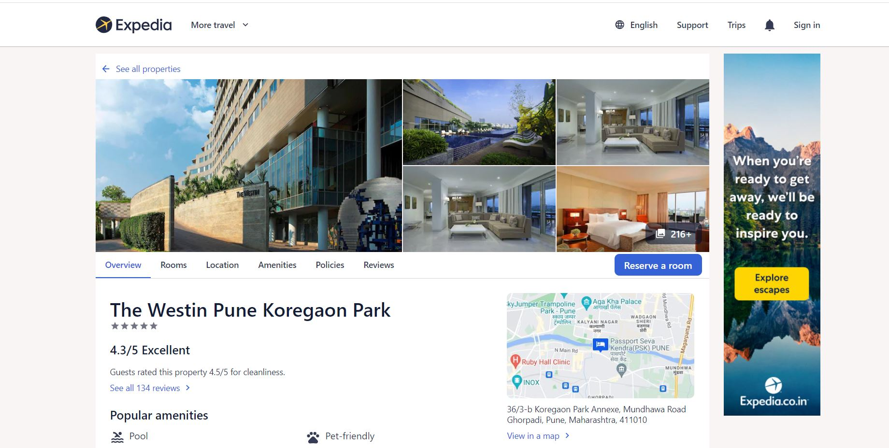
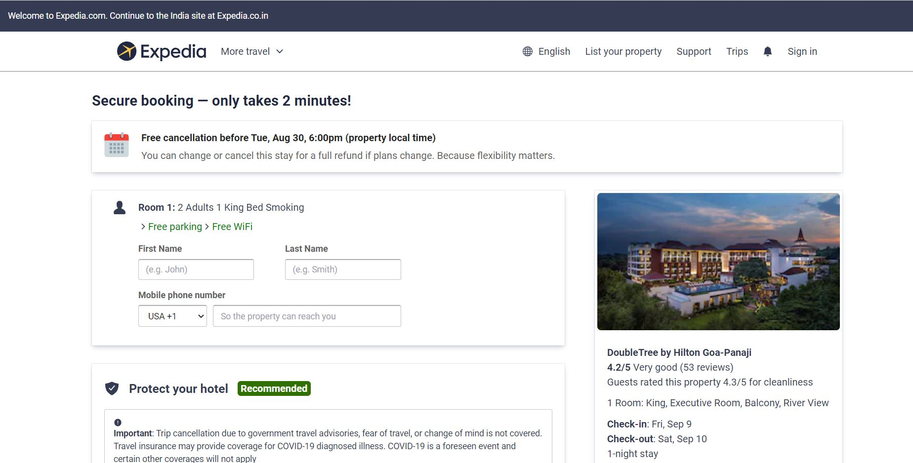

# links

<h3>oval-wall-8886</h3>

# Project-Expedia-clone

Expedia is one of the fastest growing online travel portals in Asia, offering travellers an extensive selection of hotels, activities and travel services to meet every budget and activities of every kind at competitive rates. With over hundreds of thousands of hotel partners worldwide and a comprehensive offering of flight inventory made available on the website, travellers can book everything they need for a holiday - rooms to meet every budget, activities of every kind and travel services to complement.

\*We as a team given a task to Clone the Expedia.co.in Website.\*\*

# To visit our website [Click here](https://expedia-tawny.vercel.app/)

## NPM Packages used

- ### react 

- ### react-router-dom 
- ### axios 

- ### create-react-app [![create-react-app])]

- ### react-icon
- ### React-redux
- ### Chakra-ui
- ### Tailwind
- ### Express
- ### Mongodb
- ### NodeJS

## Technologies Used

  <a href="https://reactjs.org/" target="_blank"> &nbsp;&nbsp;&nbsp;&nbsp;&nbsp;</a>
    <a href="https://developer.mozilla.org/en-US/docs/Web/JavaScript" target="_blank">  &nbsp;&nbsp;&nbsp;&nbsp;&nbsp; </a> 
    <a href="https://www.w3.org/html/" target="_blank"> &nbsp;&nbsp;&nbsp;&nbsp;&nbsp;</a>
    <a href="https://www.w3schools.com/css/" target="_blank">  &nbsp;&nbsp;&nbsp;&nbsp;&nbsp;</a>
     
    <a href="https://redux.js.org" target="_blank"> &nbsp;&nbsp;&nbsp;&nbsp;&nbsp;</a> 
    
   
  

## Features

- Fullscreen mode

### We have focused mainly on:

1.Landing Page

<h4>This is our landing page </h4>

2.Sign-in Page

<h4>Here user can Signin if account is already present else sign-up by clicking Create-account option:- </h4>

3.Stays page

<h4>This is Stays section where user can search by city</h4>

4.Hotels list Page

<h4>Here user can all the available option:- </h4>
<h4>Here user can search and filter the data as per their requirement</h4>

5.Single Hotel Page

<h4>Here user can see all the data like images , rooms available and reserve then:- </h4>

6.Payment Page

<h4>On this page user has to fill Personal Details like name, mobile no , cards details, etc :- </h4>

<h3> 
  To start the project use have to clone this repo into to computer and then
  you have to install all dependencies using npm install inside frontend and backend folder than you are ready to start the project.

  move to backend folder using cd backend and do npm run server to start backend
  to start frontend move to frontend folder and do npm start.

</h3>
## Team Member

- [@Manoj Attri](https://github.com/manojattri181)
- [@Mohammad Atique](https://github.com/mohammad-atique)
- [@Bhrugu Prasad](https://github.com/BhruguPrasad)
- [@Md Irfan](https://github.com/Md-Irfan-FullStackDeveloper)
- [@Sudipta Bhattacharjee](https://github.com/sudiptadip)
